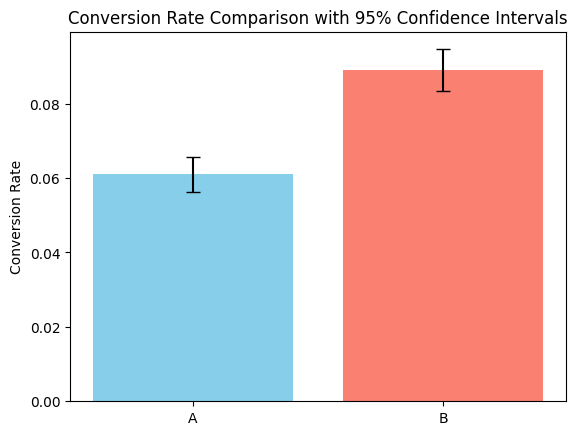
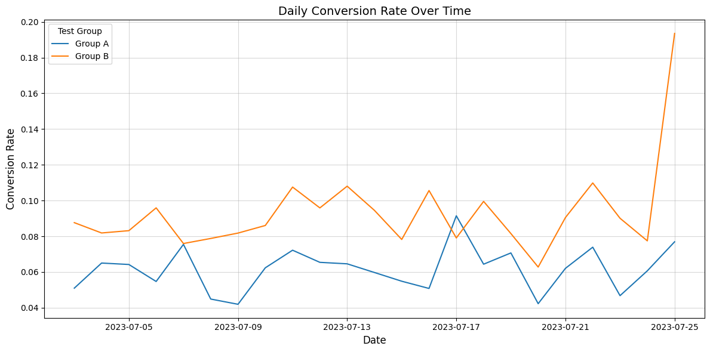

# A/B Test – Підписка в застосунку

## Мета тесту
Мета тесту – визначити, чи збільшує формулювання про "50% знижку" конверсію користувачів на покупку підписки.  

- **Група A:** користувачам пропонується купити підписку за $4.99.  
- **Група B:** користувачам пропонується купити підписку за $4.99 **зі знижкою 50%**.  

Основна метрика аналізу – **конверсія з інсталяції в платіж**.

---

## Огляд даних
- **Кількість користувачів:**  
  - Група A – `10 013`  
  - Група B – `9985`  
- **Кількість конверсій:**  
  - Група A – `611`  
  - Група B – `889`  
- **Рівень конверсії:**  
  - Група A – `0.061021`  
  - Група B – `0.089034`  
- **Період тесту:** початок – `2023-07-03`, кінець – `2023-07-25`  
- **Тривалість тесту:** `21` днів  

---

## Статистичне тестування
Для перевірки нульової гіпотези (**H0: рівень конверсії в групах A та B однаковий**) використано **z-тест для двох пропорцій**.  

- **Статистика Z:** `-7.519`  
- **p-value:** `5.49e-14`  

> Висновок: `5.49e-14` > `0.05`, тому нульова гіпотеза відхиляється, тобто рівень конверсії в групах A та B статистично відрізняється.

---

## Візуалізація
- **Порівняння конверсій у групах з 95% довірчими інтервалами:**  
    

- **Бонус – динаміка конверсії в часі:**  
    

---

## Висновки
1. Група B (зі знижкою 50%) показала вище конверсію порівняно з групою A.  
2. Враховуючи статистичну перевірку, можна стверджувати, що зміст пропозиції впливає на поведінку користувачів.

## Рекомендації
1. Впровадити варіант B (формулювання зі знижкою 50%) як основний, оскільки різниця статистично значуща (p < 0.05) і ефект не випадковий.
2. Перед повним масштабуванням - оцінити довгострокову поведінку користувачів (ретеншн, відміни підписки).

---
